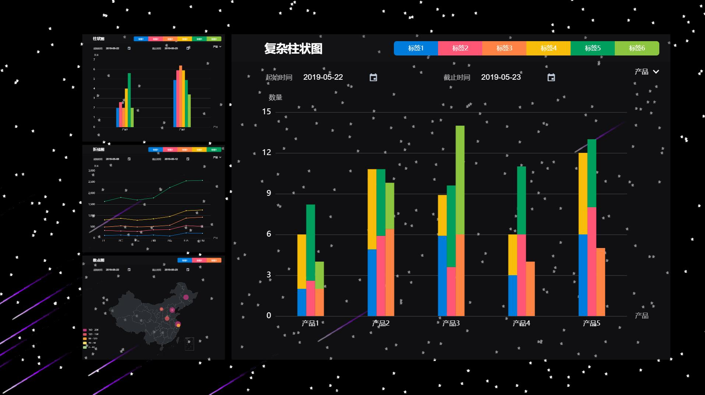

# 本地安装

``` bash
# install dependencies
npm install

# serve with hot reload at localhost:8080
npm run dev

# build for production with minification
npm run build
```

# 技术栈

- vue2.x
- vuex  存储公共变量，本例用来存储色值
- vue-router  路由
- element-ui  饿了么基于vue2开发组件库，本例使用了其中的datePicker
- echarts  web图表库
- webpack、ES6、Babel、Stylus等

# 项目截图



# 开发

具体开发可见GitHub日志

## 组件化

本项目完全采用组件化的思想进行开发。使用vue-router作为路由，每个页面都是一个组件，每个组件里又包含多个组件。可以看到，多种图表的标题和日期筛选等都是类似的格式，所以这两个都分别做成了组件。

每个图表都是一个单独的组件，也可以单独的剥离出去使用。

整体的思想为：

- 使用百分比布局，这样才能在不能大小的屏幕做到自适应
- 确定图表显示比例，长宽比
- 只做一个transform变换，这样才能提高性能

## 性能

关于性能方面，这里多说一句：

相信大家都看过在线演示的demo了，不同图表间的切换不仅有位置的变换，还有大小的变换。那么大小的变换大家都知道是用transform的scale变换，但是位置的变换呢，使用left、top？

很显然这样是不对的，但是这样确实也能实现效果，但是会非常的消耗性能。一个CSS属性的变化就相当于一个线程，那么如果使用了left、top以及transform的话就是三个线程同时开启，那你的电脑温度将会很快飙升的

正确的解决方案还是继续使用transform，使用它的<font color=red> translate </font>，如：

```css
transform: translate(-22.4%,0) scale(0.33)
```

###  散点图

point.vue

### 折线图

line.vue

### 柱状图

column.vue

### 复杂柱状图

multipleColumn.vue

### 热力图

heat.vue

## 配色

标签1---暗蓝 #019fa0---来自answers.com

标签2---粉色 #ff5675---来自CNN

标签3---橙色 #ff8345---来自taobao.com

标签4---黄色 #f8bd0b---来自IMDb

标签5---深绿 #009f5d---来自LimeWire

标签6---浅绿 #8cc540---来自classmate.com

灵感来源：http://www.colourlovers.com/digital-art/blog/2010/09/15/the-most-powerful-colors-in-the-world

## 流星背景

背景使用canvas，我把它单独做成了一个组件，因此它可以像皮肤一样随意替换，需要注意的是栈内存溢出的问题


